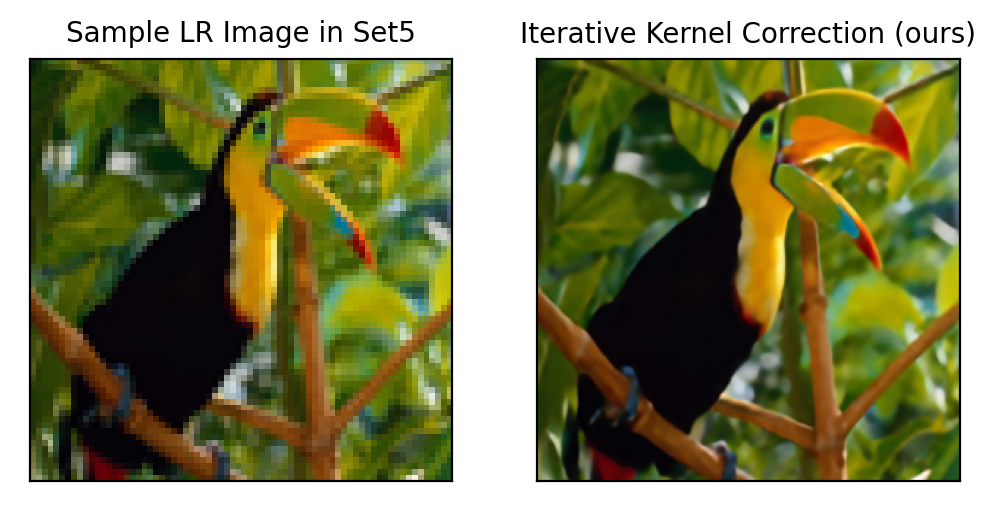
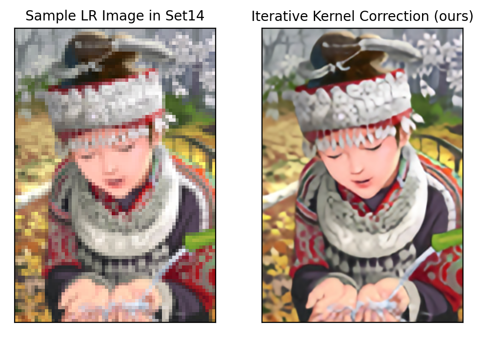
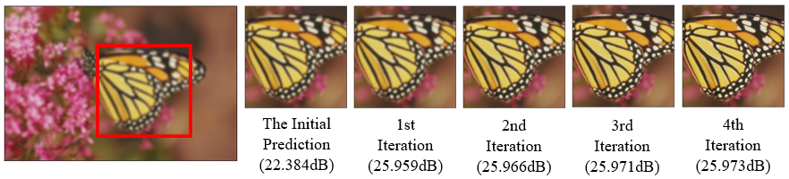
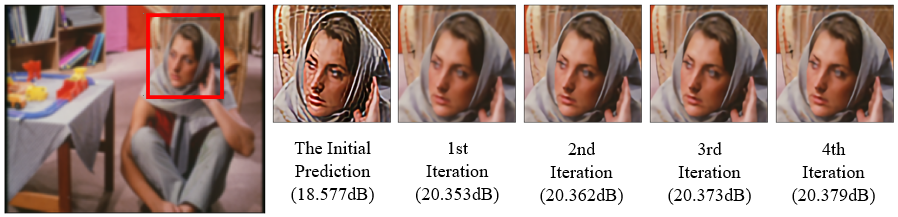
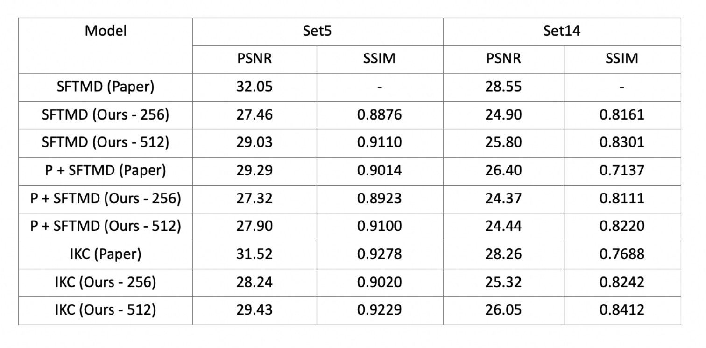

# IKC implementation
Here is an implementation of ['Blind Super-Resolution With Iterative Kernel Correction'](https://arxiv.org/abs/1904.03377)
## Prerequirements
High RAM GPU For Training
## Install
For a easier way to train and test model, you can open the CodeInpy/IKC.ipynb in colab and run the code as instructions there.
### Directory Structure
```
CodeInpy
|----final_model        # store our pretrained model
|----|----latest_P.pth  # Predictor pretrained model
|----|----latest_F.pth  # SFTMD pretrained model
|----|----latest_C.pth  # Corrector pretrained model
|----model              # store the models you train
|----AI6103_Group_Project_Report
|----dataset.py         # load dataset
|----Functions.py       # functions used for out models
|----IKC.ipynb          # you can open it on colab for train and test under our instructions
|----main.py
|----main.yml           # all the paths you can change
|----model.py           # model architecture
|----Test_IKC.py        # test IKC
|----Test_SFTMD         # test SFTMD 
|----TrainIKC           # IKC train
|----TrainSFTMD         # train SFTMD
images
|----Correcor           # store images changes during corrector process
|----RealWorldImages    # store real world images before and after our IKC
|----SyntheticImages    # store synthetic images before and after out IKC
|----result             # PSNR and SSIM result
```

## Dataset Prepraration
- For training: 
  You can choose from [Flickr2K](http://cv.snu.ac.kr/research/EDSR/Flickr2K.tar), [DIV2K](https://data.vision.ee.ethz.ch/cvl/DIV2K/)

- For testing: You can choose from [Set5](https://uofi.box.com/shared/static/kfahv87nfe8ax910l85dksyl2q212voc.zip), [Set14](https://uofi.box.com/shared/static/igsnfieh4lz68l926l8xbklwsnnk8we9.zip)

## Pretrained Model
You can download the models from CodeInpy/final_model directory

## Train
1. To train the SFTMD network, change the DIR_PATH in CodeInpy/main.yml to your own dataset diretory
   ```
   python TrainSFTMD.py
   ```
2. To train the Predictor and Corrector network, change the DIR_PATH in CodeInpy/main.yml in your own dataset directory
   ```
   python Train_IKC.py
   ```
## Test
If you want to test the data in our providing images, just run the code below. If you want to test the data in other datasets, download and  change the HR_file_path and LR_file_path in the test section in main.yaml file.
1. if you want to test on SFTMD, calculate the PSNR and SSIM with GroundTruth images, please run:
    ```
    python Test_SFTMD.py
    ```
2. if you want to test on IKC, calculate the PSNR and SSIM with GroundTruth images for each corrector iteration results, please run:
   ```
   python Test_IKC.py
   ```

## Results
### Synthetic Images


### Real World Images

### Corrector process


### PSNR & SSIM on test sets
